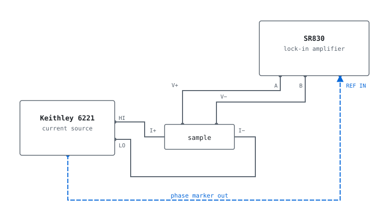

# labdrivers-plus


Python drivers for the instruments on a condensed-matter physics bench:
sourcemeters, lock-in amplifiers, cryostat and temperature controllers, magnet
power supplies, oscilloscopes, function generators and network analyzers. The
package also ships a server that holds instrument connections open in a
long-running process, so a restarted Jupyter kernel does not drop a running
cryostat and several machines can share one instrument.

## Highlights

- **One convention for every driver.** How an instrument is wired, whether GPIB,
  RS-232, LAN or a raw socket, is a constructor argument rather than a
  different class. Settings are properties and actions are methods, and a
  driver you have never used connects, validates and errors like the ones you
  use every day.
- **Complete command sets.** Each driver is transcribed from its instrument's
  programming manual, front-panel operations included, so a script can do
  anything you could do standing at the rack.
- **Validation that reads like a sentence.** Values are checked against the
  limits in the manual, and discrete settings snap to the nearest one the
  instrument supports. A rejected value is told its range:
  `The compliance voltage must be between 0.1 V and 105.0 V, but got 500 V.`
- **Timing handled for you.** Reads wait for filters to settle, and temperature
  and field sweeps yield only once each point is stable. Shutdowns ramp
  sources to zero instead of cutting them off.
- **A connection server with a live web page.** Instruments stay open in a
  process that outlives your notebook, and the page shows what is connected,
  what it last read, and who is using it. Clients need nothing beyond the
  standard library.
- **Instruments without a driver still work.** Describe an instrument's SCPI
  commands in a few lines and get a real driver back, validation and web
  panel included.
- **Tested without hardware.** The whole suite runs against a recording
  transport that asserts the exact bytes each driver puts on the wire.

## Contents

- [Quick start](#quick-start)
- [Supported instruments](#supported-instruments)
- [Installation](#installation)
- [How every driver behaves](#how-every-driver-behaves)
- [A complete measurement](#a-complete-measurement)
- [Capturing a waveform](#capturing-a-waveform)
- [The instrument server](#the-instrument-server)
- [Troubleshooting](#troubleshooting)
- [Writing a new driver](#writing-a-new-driver)
- [Origin and license](#origin-and-license)

## Quick start

```bash
pip install git+https://github.com/AlexanderBeach/labdrivers-plus.git
```

Most instruments here are reached through VISA, which is a separate runtime
that has to be installed before Python can open a GPIB, USB or serial
connection. On Windows that is normally [NI-VISA](https://www.ni.com/visa/).
If the lines below raise a `ConnectionFailure` mentioning VISA, that runtime
is what is missing, and [Installation](#installation) says how to get it. The
Oxford Mercury and Triton controllers are the exception, because they speak
over a plain network socket and need no VISA at all.

```python
from labdrivers.srs import Sr830

with Sr830(gpib_address=8) as lockin:
    print(lockin.identify())        # sanity check: sends *IDN?
    lockin.time_constant = 0.3      # seconds, snapped to the nearest setting
    x, y = lockin.measure()         # waits for the filter, then reads X and Y
```

The context manager closes the connection when the block ends, including
when the code raises partway through. That matters because a GPIB address
left open by a crashed script will often refuse the next connection.

If you do not know an instrument's address, ask VISA what it can see:

```python
from labdrivers.core.transport import get_resource_manager

for resource in get_resource_manager().list_resources():
    print(resource)                 # e.g. GPIB0::8::INSTR
```

Every public method and property has a docstring transcribed from the
programming manual, so `help(Sr830)` is the reference for that driver.

## Supported instruments

| Vendor | Driver | Instrument | Requires |
| --- | --- | --- | --- |
| Keithley | `Keithley2400` | 2400-series SourceMeter (2400, 2400-LV, 2401, 2410, 2420, 2425, 2430, 2440), with per-model source limits detected from `*IDN?` | VISA |
| Keithley | `Keithley6221` | 6221 AC and DC current source | VISA |
| Keithley | `Keithley2182` | 2182 / 2182A nanovoltmeter | VISA |
| SRS | `Sr830` | SR830 DSP lock-in amplifier | VISA |
| Oxford Instruments | `Triton200` | Triton 200 dilution refrigerator | none (raw TCP) |
| Oxford Instruments | `MercuryIps`, `MercuryIpsTeslatron` | Mercury iPS magnet supply, incl. the TeslatronPT fit | none (raw TCP) |
| Oxford Instruments | `MercuryItc`, `MercuryItcHeliox` | Mercury iTC temperature controller, incl. the HelioxVT fit | none (raw TCP) |
| Oxford Instruments | `Ips120` | IPS 120-10 magnet power supply | VISA |
| Oxford Instruments | `Itc503` | ITC 503 temperature controller | VISA |
| Lake Shore | `Ls332` | Model 332 temperature controller | VISA |
| Quantum Design | `Ppms`, `Dynacool`, `VersaLab`, `Svsm`, `Mpms` | cryostats, through MultiVu | MultiVu running on the host |
| National Instruments | `Nidaq` | DAQ analog and digital I/O | NI-DAQmx runtime |
| Keysight | `Keysight33500` | 33500B / 33600A waveform generators | VISA |
| Keysight | `InfiniiVision` | InfiniiVision X-Series oscilloscopes (1000 X to 6000 X) | VISA |
| Rigol | `RigolDG1000Z` | DG1000Z waveform generators | VISA |
| Copper Mountain / Keysight | `Vna` | Copper Mountain VNAs (S2VNA/S4VNA) and Keysight ENA (E5061B, E5071C) | VISA |
| Fangcun Keyi | `Rotator` | single-axis rotation probe | bundled vendor DLL (Windows) |

An instrument that is not listed but speaks SCPI can still be used. See
[instruments without a driver](#instruments-without-a-driver).

## Installation

The package is not on PyPI, so install it from the repository:

```bash
pip install git+https://github.com/AlexanderBeach/labdrivers-plus.git
```

```bash
uv add git+https://github.com/AlexanderBeach/labdrivers-plus.git
```

Requires Python 3.11 or newer. That gets you every driver.

Most instruments here are reached through VISA, which needs a runtime installed
separately to talk to GPIB, USB or serial buses. On Windows that is normally
[NI-VISA](https://www.ni.com/visa/). Without it, opening an instrument raises a
`ConnectionFailure` saying the VISA library could not be loaded. The Oxford
Mercury and Triton controllers speak over a raw TCP socket and need no VISA at
all.

A few instruments are reached through a vendor runtime instead of VISA. The
National Instruments DAQ needs NI-DAQmx, and the Quantum Design cryostats need
MultiVu running on the host machine. Neither is required to install
labdrivers-plus, and a machine without them runs every other driver normally.
The rotation probe also uses a vendor library, but that one ships with the
package.

### The server

The server and its web page are optional:

```bash
git clone https://github.com/AlexanderBeach/labdrivers-plus.git
cd labdrivers-plus
pip install ".[server]"
```

Install this on whichever machine the instruments are wired to. A machine that
only connects to a server running elsewhere does not need it, because the
client is standard library and comes with the base install.

### If you have never used GPIB

GPIB, also called IEEE-488, is the stackable-connector bus that most bench
instruments built in the last forty years speak. Each instrument on it has an
address between 0 and 30, set from its own front panel, and several instruments
daisy-chain along one cable so long as no two share an address.

Your computer joins that bus through an adapter, most often an NI GPIB-USB-HS,
whose driver arrives with NI-VISA. Plug in the adapter, install NI-VISA, and
the scan in [Quick start](#quick-start) will list what it can see.

## How every driver behaves

The point of the package is that once you have used one driver, you have used
them all. The rules below hold everywhere.

### One constructor, any interface

The same driver reaches the same instrument over any interface the instrument
has. Nothing in a driver assumes one, so an instrument with a rear panel full
of connectors can be used through whichever is convenient:

```python
Sr830(gpib_address=8)                                  # GPIB, shorthand
Sr830(resource_name="GPIB0::8::INSTR")                 # GPIB, the long form
Sr830(resource_name="ASRL3::INSTR", baud_rate=9600)    # RS-232
Keysight33500(resource_name="USB0::0x0957::0x2C07::MY1::INSTR")   # USB
Keysight33500(resource_name="TCPIP0::192.168.0.20::INSTR")        # LAN
Vna(resource_name="TCPIP0::127.0.0.1::5025::SOCKET")   # LAN, raw socket
Triton200(ip_address="192.168.0.12")                   # raw socket, no VISA
```

`resource_name=` accepts anything VISA can address, so GPIB, USB, LAN and
serial all reach every driver. `ip_address=` opens a plain TCP socket instead,
with no VISA runtime involved, and is how the Oxford Mercury and Triton
controllers are reached. Where the choice of interface changes what the
instrument expects, the driver handles it: an SR830 is told to answer on the
port it was reached over, because one connected by serial while it still
thinks it is on GPIB accepts every command and replies into the other
connector.

Every driver is a context manager, and `identify()` returns the `*IDN?`
reply. Call it first, so a wrong address fails plainly instead of three
steps later when a reading looks strange.

Three drivers are exceptions, because they reach their instruments through a
vendor library rather than a wire this package speaks: `Nidaq` takes a device
name, `Rotator` takes an axis and a serial port, and the Quantum Design
drivers take the address of a machine running MultiVu. For the same reason the
server cannot hold those three.

### Units are SI, and there is always an escape hatch

Every value in and out of a driver is in SI base units unless its docstring
says otherwise: seconds, volts, amps, hertz, tesla, kelvin. Timeouts are in
seconds everywhere, including where the instrument counts milliseconds
internally.

When a driver has no property for something, send the command yourself. Every
driver inherits `write` and `query`:

```python
lockin.write("OUTX 1")
lockin.query("*IDN?")
```

And when an instrument is doing something you cannot explain, print the
traffic:

```python
from labdrivers.core import enable_logging

enable_logging()          # every command sent and every reply received
```

### Settings are properties, actions are methods

Anything an instrument *stores* is a property, so configuring it is
assignment. Anything an instrument *does* is a method with a verb for a name:

```python
lockin.sensitivity = 500e-9     # a setting
lockin.auto_gain()              # an action
```

### Values are validated, and discrete settings snap

Most instruments accept only a fixed ladder of settings. A value between two
rungs takes the nearer one, and you can read back what you got:

```python
lockin.time_constant = 0.47
lockin.time_constant            # 0.3, the nearest setting the SR830 has
```

A value off the end of the ladder is refused rather than snapped, because the
nearest rung to a number that far out is not what anybody meant. Asking for a
sensitivity of 500 while thinking in nanovolts would otherwise have set 1 V.

A value out of range raises `RangeError`, and the message names the setting,
the accepted range and the offending value, in the same wording every driver in
the package uses:

```python
source = Keithley6221(gpib_address=12)
source.compliance = 500
# RangeError: The compliance voltage must be between 0.1 V and 105.0 V, but got 500 V.
```

A setting name that does not exist is refused too. Python would otherwise put
the attribute on the object and send nothing at all, leaving the instrument on
whatever it was already set to:

```python
lockin.time_const = 0.3
# UnknownSetting: The Sr830 has no setting called 'time_const'. Did you mean 'time_constant'?
```

Assigning to something the instrument does rather than something it has is
refused the same way, which catches the habits carried over from another
instrument in the rack:

```python
lockin.output = True
# UnknownSetting: 'output' on the Sr830 is something it does, not something it
# has. Call output(...) instead of assigning to it.
```

### Reads wait, sweeps are generators

Where an instrument needs time to settle before a reading means anything,
the driver waits: `Sr830.measure()` holds off five time constants per filter
pole before reading, because an instrument will always hand you a number
whether or not it has finished responding.

A driver with something worth sweeping offers the sweep as a generator, so
your loop keeps its shape while the driver does the stepping and the
waiting:

```python
fridge = Triton200(ip_address="192.168.0.12")

for temperature in fridge.sweep_temperature(1.5, 4.0, step=0.1, hold=120):
    x, y = lockin.measure()
    print(temperature, x, y)
```

| Sweep | Drivers | Yields |
| --- | --- | --- |
| `sweep_temperature` | `Triton200`, `MercuryItc`, `Ls332` | temperature actually reached, once stable |
| `sweep_field` | `MercuryIps` axis, e.g. `supply.z` | field actually reached, once the magnet arrives |
| `sweep_angles` | `Rotator` | angle actually reached |
| `sweep_source` | `Keithley2400` | (level, voltage, current) at each point |
| `sweep_frequency` | `Keysight33500`, `RigolDG1000Z` | each frequency as it is set |

Each takes either `points=` (a number of values) or `step=` (a spacing). The
temperature and field sweeps also take `hold=`, the number of seconds a reading
has to stay inside the tolerance band before the point counts as reached, since
a cryostat routinely passes through its setpoint on the way and touching the
right number once is not the same as having settled at it. `tolerance=` is a
fraction of the target rather than an absolute number, so the default of 0.05
is a window of 0.075 K at 1.5 K and 15 K at 300 K. The Mercury iTC takes the
sensor first, because that controller runs more than one loop.

These run from Python rather than handing the instrument its own staircase
to execute. That is slower, but readings arrive one at a time, so you can
plot as it goes or stop partway through without losing what you already have.

### Shutdowns are gradual

Drivers for instruments that can put energy into something provide
`safe_shutdown()`, which gets to zero gradually rather than at once. On a
Keithley 6221 it stops the waveform, walks the current down in steps and
switches the output off. On a magnet supply it ramps the field to zero and
holds, and on a temperature controller it stops the heater being driven.

### Errors are catchable as one type

Everything this package raises derives from `LabdriversError`, which comes
from `labdrivers.core`, so one `except` catches every failure the package can
produce without also catching the ordinary Python mistakes in your own script.
The message says what happened rather than which line of the driver noticed it:

| Exception | What it usually means |
| --- | --- |
| `LabdriversError` | the base of the five below, and what the server raises directly |
| `ConnectionFailure` | wrong address, instrument switched off, or a cable |
| `ConnectionFailure` mentioning VISA | no VISA runtime installed, see [Installation](#installation) |
| `RangeError` | the value is outside what the instrument accepts, and the message says the range |
| `InstrumentError` | the instrument reported a fault from its own error queue |
| `InstrumentTimeoutError` | it did not answer, or a wait never settled |
| `UnknownSetting` | the name is not a setting that instrument has |

## A complete measurement

A four-probe resistance measurement, from an empty notebook to a file of
data. A Keithley 6221 sources the current and an SR830 lock-in reads the
voltage, but almost nothing below is specific to those two instruments. This
is the shape every measurement in this package has.

<picture>
  <source media="(prefers-color-scheme: dark)" srcset="docs/four-probe-dark.svg">
  
</picture>

```python
import csv
from labdrivers.keithley import Keithley6221
from labdrivers.srs import Sr830

with Keithley6221(gpib_address=12) as source, Sr830(gpib_address=8) as lockin:
    print(source.identify(), lockin.identify())

    source.wave_function = "sine"
    source.wave_frequency = 17.777
    source.compliance = 10

    lockin.reference_source = "external"
    lockin.input_configuration = "A-B"
    lockin.time_constant = 0.3
    lockin.sensitivity = 500e-9

    source.arm_waveform()
    source.start_waveform()

    try:
        with open("resistance.csv", "w", newline="") as handle:
            writer = csv.writer(handle)
            writer.writerow(["current_A", "x_V", "y_V", "resistance_ohm"])

            for current in [1e-6, 2e-6, 5e-6, 1e-5]:
                source.wave_amplitude = current
                x, y = lockin.measure()        # settles, then reads X and Y
                writer.writerow([current, x, y, x / current])
                print(f"{current:.1e} A -> {x / current:.4f} ohm")
    finally:
        source.safe_shutdown()
```

The shutdown sits in a `finally` rather than at the end of the block. Closing
a connection is not the same as switching an output off, and `with` only does
the first, so a Ctrl-C at point three of four would otherwise leave the source
still driving the sample. Anything that puts energy into a sample wants its
`safe_shutdown()` where an interruption still reaches it.

Each row is written as it arrives rather than collected in a list and saved
at the end. It costs nothing, and a measurement interrupted after two hours
still has two hours of data on disk.

That script holds its own connections, so restarting the kernel drops them. To
move it onto a server, only the two constructors change:

```python
from labdrivers.client import connect

source = connect("source")
lockin = connect("lockin")
```

Every line after that is identical, because `connect` returns the real driver
class.

## Capturing a waveform

The measurement above reads one number at a time from a slow instrument. This
one is the other shape: a function generator drives a signal, an oscilloscope
captures the whole trace at once, and what comes back is an array, not a
reading. Neither instrument here is on GPIB, because modern bench gear mostly
is not.

```python
import csv
from labdrivers.keysight import InfiniiVision, Keysight33500

generator = Keysight33500(resource_name="USB0::0x0957::0x2C07::MY52::INSTR")
scope = InfiniiVision(resource_name="TCPIP0::192.168.0.31::INSTR")

with generator, scope:
    generator.apply("sine", frequency=1e3, amplitude=2.0)
    generator.output = True

    scope.autoscale()
    scope.set_edge_trigger(source=1, level=0.0, slope="positive")
    scope.timebase_scale = 200e-6

    scope.digitize(channel=1)                       # acquire once, then stop
    times, volts = scope.read_waveform(channel=1)

    print(scope.measure("peak to peak"), "V")
    print(scope.measure("frequency"), "Hz")

    with open("trace.csv", "w", newline="") as handle:
        writer = csv.writer(handle)
        writer.writerow(["time_s", "voltage_V"])
        writer.writerows(zip(times, volts))

    generator.safe_shutdown()
```

A few of those calls are doing more than they let on.

`apply()` sets shape, frequency and amplitude in one command, because that is
what the instrument offers. Where a manual gives a combined command, the driver
does too, rather than making you send three.

`read_waveform` returns seconds and volts, not raw counts. Scopes transfer
traces as integers with a separate preamble giving the scaling, and the driver
reads the preamble and applies it for you. Pass `points=` to transfer fewer, or
`waveform_format="byte"` to halve the transfer at the cost of vertical
resolution.

`measure()` asks the scope for a quantity rather than computing it from the
array. That is usually the better answer, since the instrument measures on the
full-rate record, not on whatever you transferred. It returns `None` when the
scope cannot make the measurement. Nearly always that means there is no
signal, or less than one period of it, on screen.

Two longer examples, each a complete measurement on one of the group's
cryostats with temperature, field and angle all swept, are in
[`examples/`](examples/README.md).

## The instrument server

Connections made in a notebook die with the kernel, and a dropped GPIB
handle can refuse the next connection until something clears it. The server
moves those connections into its own process, where no kernel restart can
reach them. A notebook can then be restarted underneath a running cryostat
without dropping the magnet, and two people can use one instrument from two
machines. A web page shows what is connected and what it last read without
anybody running a cell.

```bash
pip install ".[server]"      # from a clone, see Installation
labdrivers-server
```

It opens the page for you, so there is no address to copy anywhere.
(`labdrivers-server --help` lists the options, and `--no-browser` is for running
it as a service.)


To put an instrument on it, press **Add instrument**, then **Scan**. That
lists every resource VISA can see on the server machine, asks each one for
`*IDN?`, and suggests a driver based on what came back. Give it a name and
it is live. Whatever you add is written to `~/.labdrivers/server.toml`, so
the same instruments come back the next time the server starts.

### From a notebook

```python
from labdrivers.client import connect

lockin = connect("lockin")            # or connect("lockin", "cryostat-pc:8000")
lockin.time_constant = 0.3
x, y = lockin.measure()
```

What `connect` hands back is a real `Sr830` rather than a proxy imitating
one. Methods, docstrings and autocompletion are the driver's own, and
measurement code does not change at all when it moves onto a server. The
client needs only the standard library, so a measurement machine has nothing
to install beyond `labdrivers-plus` itself.

Manage what the server holds from a notebook too:

```python
from labdrivers.client import Server

lab = Server("cryostat-pc:8000")
lab.instruments()                     # what it holds, and whether each answers
lab.scan()                            # what VISA can see on that machine
lab.add("magnet", "MercuryIps", ip_address="192.168.0.11")
lab.reconnect("lockin")               # after power-cycling an instrument
```

The server also exposes its REST API at `/docs`.

### What the page does, and does not

Panels are built by reading the driver classes, so a driver added later
appears with no interface code written for it. The page **never reads an
instrument on its own**: opening it costs nothing on any bus, and the only
thing that sends a command is the **Read** button. Every panel shows the age
of its numbers. Each panel also has a console, so a command nobody described
can still be sent.

Each instrument is guarded by a lock that serializes single calls, not whole
transactions. A reading taken from the page can land between two commands of
somebody else's measurement, so coordinate with whoever is mid-run.

### Instruments without a driver

Most instruments answer SCPI, so one with no module here is still usable.
Describe its commands instead of writing a driver:

```python
lab.add(
    "psu", "Generic", resource_name="GPIB0::5::INSTR",
    settings=[
        {"name": "voltage", "query": "VOLT?", "write": "VOLT {}",
         "unit": "V", "minimum": 0, "maximum": 30},
        {"name": "current", "query": "CURR?", "unit": "A"},
    ],
)
```

The same is done from the page by choosing `Generic` and filling in a row
per setting, where `{}` is where the value goes. It also works with no server
running at all, through `labdrivers.server.generic.build`, which hands back a
driver class you construct like any other. The result is a full driver, web
panel and all, and its error messages use the package's standard wording.
`ask()` and `send()` cover anything the description does not:

```python
supply = lab.connect("psu")
supply.voltage = 40
# RangeError: The voltage must be between 0 V and 30 V, but got 40 V.
supply.ask("SYST:ERR?")
```

### Configuration

Everything lives in `~/.labdrivers/server.toml`, written by the server as
instruments are added and removed. You never have to edit it, but it is
plain TOML if you would rather:

```toml
[server]
host = "0.0.0.0"        # every interface. Use 127.0.0.1 for this machine only
port = 8000
refresh = 20            # seconds between the page re-reading the server's view
health_check = 60       # seconds between asking an idle instrument if it answers
```

`refresh` touches no instrument. `health_check` does send a command, because
an open handle is not a live instrument. It skips anything busy, and `0`
turns it off.

> **Security:** the server has no authentication. Anyone who can reach it
> can drive anything it holds. That is the right trade on an isolated lab
> network, but do not expose it beyond one.

## Troubleshooting

- **Nothing shows up when scanning.** The usual causes are a cable, an
  instrument that is switched off, or two instruments left on the same GPIB
  address.
- **`ConnectionFailure` mentioning VISA.** No VISA runtime is installed. See
  [Installation](#installation).
- **An address refuses to open.** A previous session left it open. Closing
  that session, restarting, or letting the server own the connection clears
  it, which is one of the reasons the server exists.
- **A lock-in connects but never answers.** An SR830 replies on whichever port
  it was last told to use. The driver sets that from how you connected, so pass
  `interface="gpib"` or `interface="rs232"` only if you need to override it.
- **A reading looks wrong immediately after a change.** Instruments answer
  before they have settled. Use `measure()` and the sweep generators, which
  wait, rather than reading properties straight after an assignment. You can always locally
  change the wait/settle times for your drivers
- **GPIB-USB is not working.** Unfortunately, replica GPIB-USB cables and even the genuine ones
  have a habit of bricking when things get updated on a computer. Sometimes this can be fixed by
  trying a different USB port (2 vs 3) or reinstalling older versions of NI 488.2. But the most effective thing
  to do is just not touch any of these things once it is working.

## Writing a new driver

Subclass `Instrument`, or `ScpiInstrument` if it speaks IEEE 488.2, and make
each setting a property:

```python
class Sr830(Instrument):
    IDENTIFIER = "SR830"

    @property
    def time_constant(self):
        """Returns the time constant, in seconds."""
        return TIME_CONSTANTS[self.query_integer("OFLT?")]

    @time_constant.setter
    def time_constant(self, value):
        index, _ = nearest_allowed(value, TIME_CONSTANTS, "time constant", " s")
        self.write(f"OFLT {index}")
```

That is all the server needs: it builds a panel by reading the class, and
`IDENTIFIER` is what scanning matches against `*IDN?`. Validate with
`check_range`, `check_choice`, `check_boolean` or `nearest_allowed` from
`labdrivers.core.validators` so your messages match every other driver, and
test against `RecordingTransport`, where a single wrong byte on the wire
fails the test.

The class is the whole list of what a driver has. Settings are properties, and
anything else the constructor fills in is declared beside them:

```python
class Ips120(OxfordLegacyInstrument):
    field_limit = None

    def __init__(self, *args, field_limit=DEFAULT_FIELD_LIMIT, **kwargs):
        super().__init__(*args, **kwargs)
        self.field_limit = float(field_limit)
```

Assigning a name the class does not have raises rather than quietly creating an
attribute, which is what turns `lockin.time_const = 0.3` from a measurement
taken at the wrong setting into an error. An object a driver hands out, such as
a magnet axis, gets the same treatment by inheriting `Settings` from
`labdrivers.core`.

Bench-specific addresses belong in your own lab module, not in a driver:

```python
# mylab.py
from labdrivers.srs import Sr830

def lockin():
    return Sr830(gpib_address=8)
```

## Origin and license

A fork of [masonlab/labdrivers](https://github.com/masonlab/labdrivers),
whose history it keeps.

MIT licensed. See [LICENSE](LICENSE).
