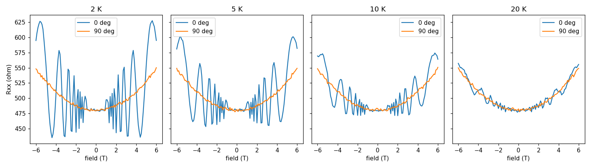
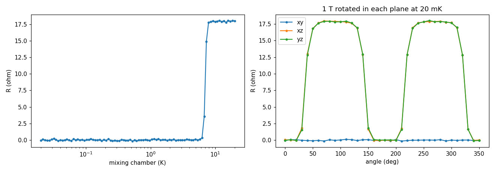

# Examples

Two complete measurements, each a notebook that runs top to bottom. They are written
against the instruments in this group's two cryostats, and the settings cell at the
top of each is the only thing to change for a different sample or a different rack.

## Field sweeps on the Teslatron

[`teslatron_field_sweeps.ipynb`](teslatron_field_sweeps.ipynb) measures a graphene
Hall bar with a lock-in at four temperatures from 2 K to 20 K. At each temperature it
sweeps the field from -6 T to 6 T with the sample at 0 degrees and again at 90
degrees, plotting as it goes, and finishes at zero field, base temperature and zero
angle. Only the perpendicular field acts on a two-dimensional sample, so the two
angles look nothing alike.



## Cooldown and field rotation on the Triton 200

[`triton_cooldown_and_rotation.ipynb`](triton_cooldown_and_rotation.ipynb) logs the
resistance of a thin NbSe2 flake with a Keithley 6221 and 2182A in pulse-delta mode as
the dilution fridge cools from 20 K to 20 mK, then rotates a 1 T field through a full
circle in each of three planes. The flake is superconducting with the field in its
plane and not with the field tilted out of it, which is what the three curves show.



Both plots are drawn from made-up data shaped like the measurement, so you can see
what a run should look like before you have one.

## Reading a data file back

Each notebook writes CSV with a few provenance lines first, so pandas needs to be told
to skip them:

```python
import pandas as pd

data = pd.read_csv("teslatron_2026-09-01_1430.csv", comment="#")
```
